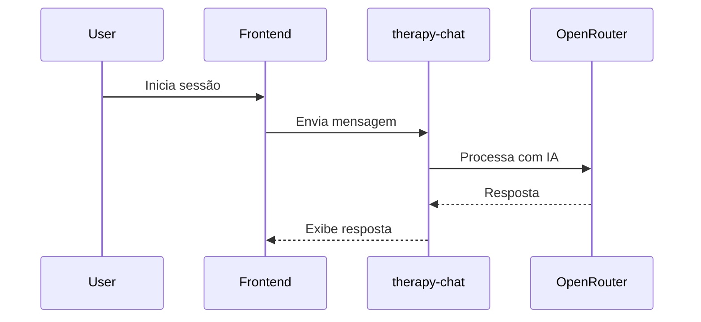
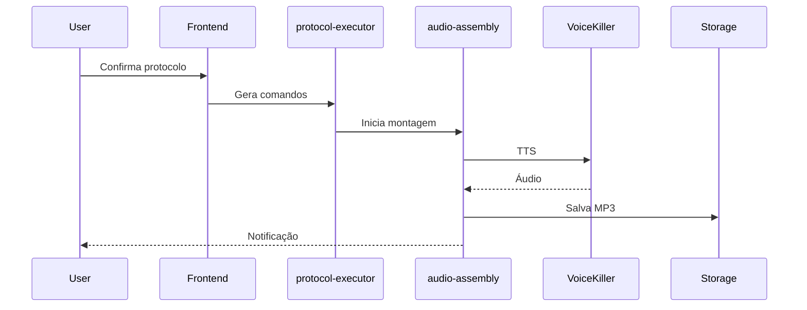
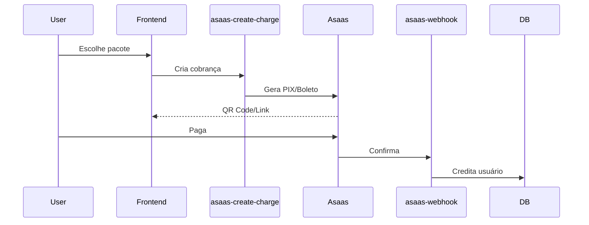

# 🏛️ Arquitetura do Sistema

## Visão Geral

```
┌─────────────────────────────────────────────────────────────┐
│                        FRONTEND                              │
│  React + TypeScript + Vite + Tailwind + shadcn/ui           │
└─────────────────┬───────────────────────────────────────────┘
                  │
                  ▼
┌─────────────────────────────────────────────────────────────┐
│                      SUPABASE                                │
├─────────────────┬─────────────────┬─────────────────────────┤
│   Auth          │   Database      │   Storage               │
│   (Users)       │   (PostgreSQL)  │   (Áudios/Arquivos)     │
├─────────────────┴─────────────────┴─────────────────────────┤
│                    Edge Functions                            │
│   therapy-chat | protocol-executor | audio-assembly | etc    │
└─────────────────────────────────────────────────────────────┘
                  │
                  ▼
┌─────────────────────────────────────────────────────────────┐
│                    PROVIDERS EXTERNOS                        │
├─────────────────┬─────────────────┬─────────────────────────┤
│   OpenRouter    │   VoiceKiller   │   Asaas                 │
│   (LLM)         │   (TTS/Clone)   │   (Pagamentos)          │
└─────────────────┴─────────────────┴─────────────────────────┘
```

## Stack Tecnológico

| Camada | Tecnologia | Versão |
|--------|------------|--------|
| Frontend | React | 18.3.x |
| Bundler | Vite | 5.4.x |
| Estilização | Tailwind CSS | 3.4.x |
| Componentes | shadcn/ui | - |
| State | TanStack Query | 5.x |
| Backend | Supabase Edge Functions | Deno |
| Banco | PostgreSQL | 15 |
| Auth | Supabase Auth | - |

## Fluxos Principais

### 1. Sessão de Terapia


### 2. Protocolo de Autocura


### 3. Compra de Créditos


## Banco de Dados

### Tabelas Principais
- `user_profiles` - Dados do usuário e configurações de voz
- `therapy_sessions` - Sessões de terapia
- `session_messages` - Mensagens do chat
- `user_credits` - Saldo de créditos
- `usage_tracking` - Histórico de consumo
- `assembly_jobs` - Jobs de montagem de áudio
- `audio_fragments_cache` - Cache de TTS
- `sentimentos` - Base de sentimentos
- `therapy_facts` - Memória persistente da IA sobre o usuário

## Segurança e Privacidade

### Proteção de Dados
- **JWT**: Autenticação segura via Supabase Auth.
- **RLS (Row Level Security)**: Isolamento total de dados entre usuários em nível de banco de dados.
- **Edge Functions**: Validação rigorosa de tokens e permissões antes de qualquer processamento.
- **API Keys**: Gerenciadas de forma segura em variáveis de ambiente (Secrets) do Supabase.

### Direitos do Usuário (LGPD/GDPR)
O sistema implementa o "Direito ao Esquecimento" através de:
- **Exclusão Granular**: O usuário pode optar por remover apenas conversas, apenas sentimentos ou apenas dados de voz.
- **Limpeza de Memória (Facts)**: Remoção de dados extraídos automaticamente pela IA.
- **Exclusão Nuclear (Conta)**: Processo irreversível que remove o registro de autenticação (`profiles`), todos os buckets de armazenamento e dados relacionais, seguido de `signOut`.
- **Confirmação de Duplo Fator (UI)**: Exigência de confirmação digitada para evitar deleções acidentais de dados sensíveis.
